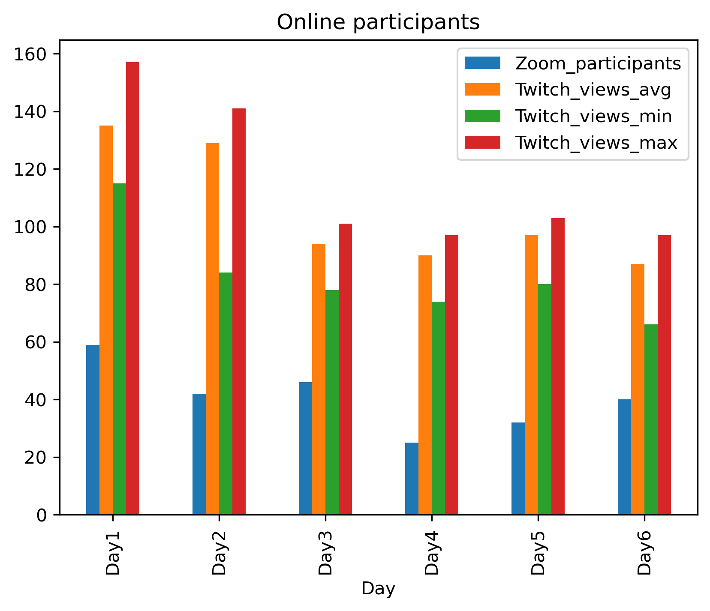
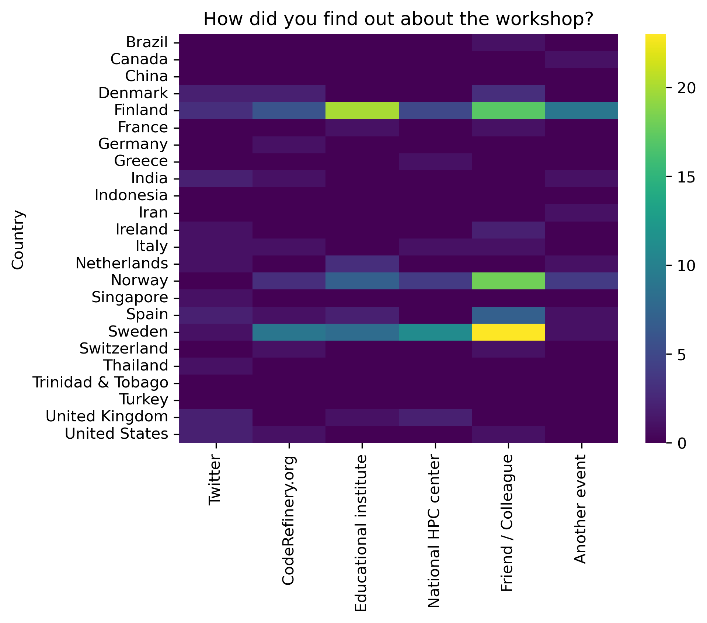

+++
title = "Statistics"
template = "statistics.html"
aliases = ["/workshops/statistics"]
+++

This is mainly to simplify reporting to funding organizations. But maybe it is
also interesting otherwise.

  
   

