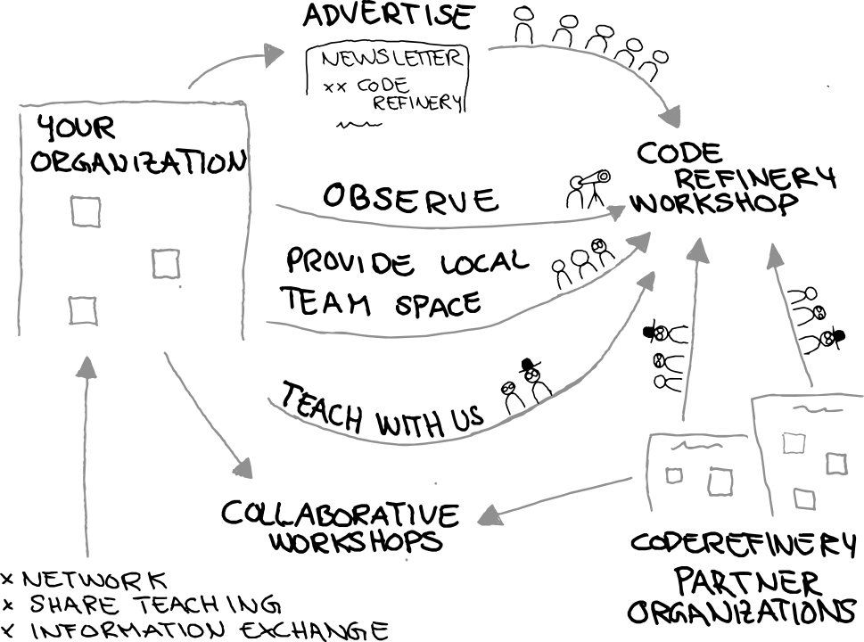

+++
title = "Why should your organization support CodeRefinery and how?"
slug = "2024/06/07/organisation-info-support-cr-how"
description = "Organizations can support the CodeRefinery project in several ways to make it sustainable and can have a mutually advantageous collaboration."

[extra]
authors = "Dhanya Pushpadas, Samantha Wittke, Radovan Bast"
+++

# Why should your organization support CodeRefinery and how?

There are many courses at universities and on the internet about learning how to code for researchers. But not many teach about sustainable software development or how to collaborate with others.

The consequences of this gap are that researchers tend to start from scratch, code on their own, or that a lot of time is spent on figuring out old codes by onself or others instead of spending that valuable time on research.

The idea of the CodeRefinery project is to help researchers that already know how to code (in any language) to increase their codes reproducibility and show some tools that can help on this journey. 

CodeRefinery is a growing training network. We try to make this project more accessible and inclusive. We developed public and freely available and reusable learning and teaching materials on many topics around research software development in order to improve its FAIR-ness (Findable, Accessible, Interoperable, Reusable).

Our workshops foster collaborative research/work environment to increase productivity and efficiency. 
The workshops themselves are interactive online events, to which participants can join individually or in team.
Teams usually have some kind of advanced person with them to guide through the exercise sessions.

From our point of view, organizations can support the CodeRefinery project in many different ways, as can be seen from the following figure:

### Advertise
The easiest way to support us is to advertise the workshop to your network. In that way, you can get people that know about FAIR software development back and can start implementing it in their work creating a more collaborative working environment regarding research software. By participating, your organization contributes to improving research software quality.

### Observe
If you are curious about how these workshops work, you can always send observers: a CodeRefinery workshop is a special event, let your teachers observe how we do things and maybe we can learn a thing or two from each other.

### Teach with us
The most valuable contribution for us is to let your experienced employees work on lesson development, or be an instructor on worktime ("contribute in kind"). That way we can learn from each other and everyone can bring in their expertise to make the project sustainable. In-kind contribution can be facilitated by including it as apart of your organisation's culture to develop employee's competence and accelerate knowledge transfer.

### Provide a local team space
If you want to provide a better way of learning together in a CodeRefinery workshop, provide a (virtual or real) room for a team from your institution to join the workshop together ("bring your own classroom"). This facilitates collaborative learning. You can make use of our central registration system or use your own (if you need control over own registration, credits, schedule).We mention all "local breakout rooms" on our webpage, if wished, to maximize outreach for these possibilities.

### Collaborative Workshops
 Within the CodeRefinery community an organization can also collaborate with CodeRefinery partner organizations on other trainings that otherwise could not happen due to missing resources for. In that way we can share the "burden" of teaching. One example for such collaboration: Aalto university HPC kickstart with participants from all over Nordics, partners contribute to teaching and cluster specific instructions

### User Community
If you are a part of a specific user community or a project, you can benefit similarly by supporting CodeRefinery.

The CodeRefinery team is happy to discuss these or other possibilities further via email or arrange a meeting. Please contact support@coderefinery.org, if you are interested.

*Together we can improve research software practices, promote collaboration, develop expertise, and establish an inclusive training network!*

 
